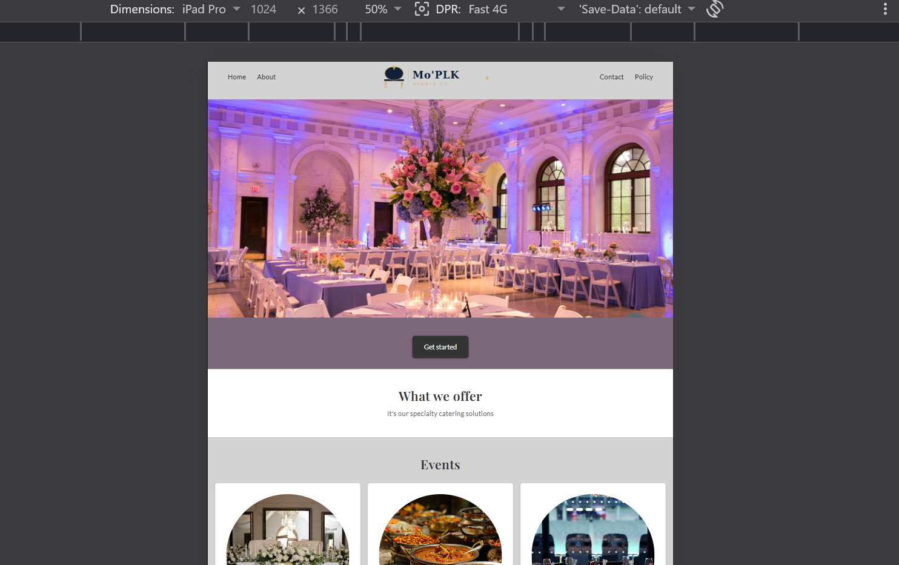
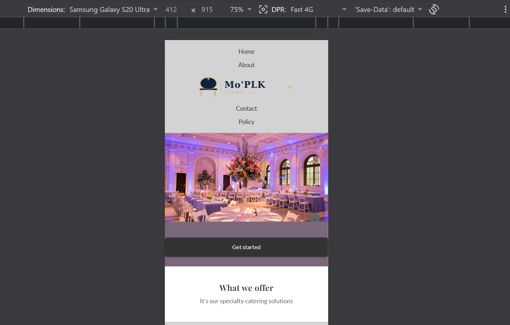
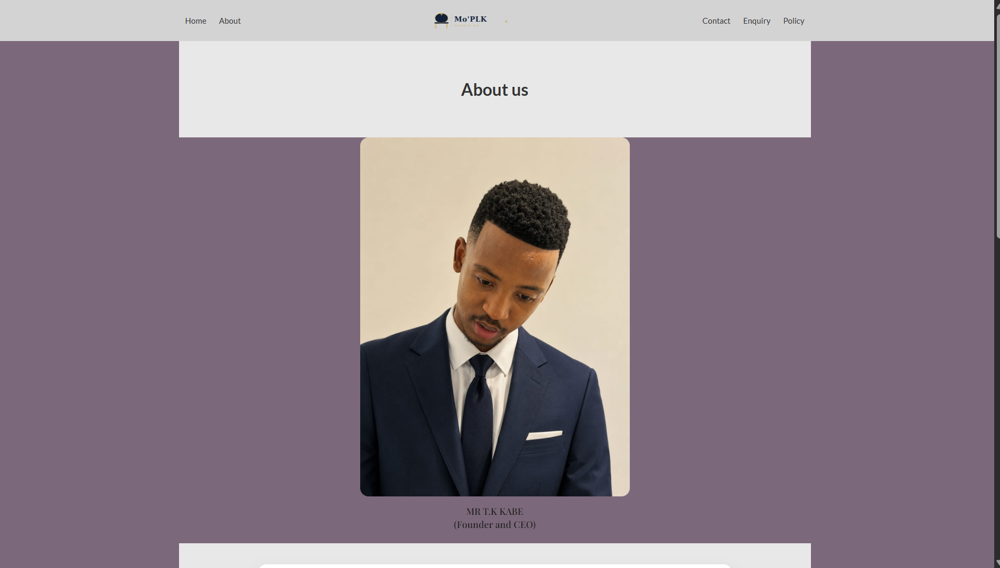
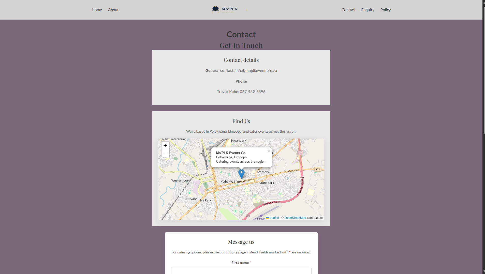
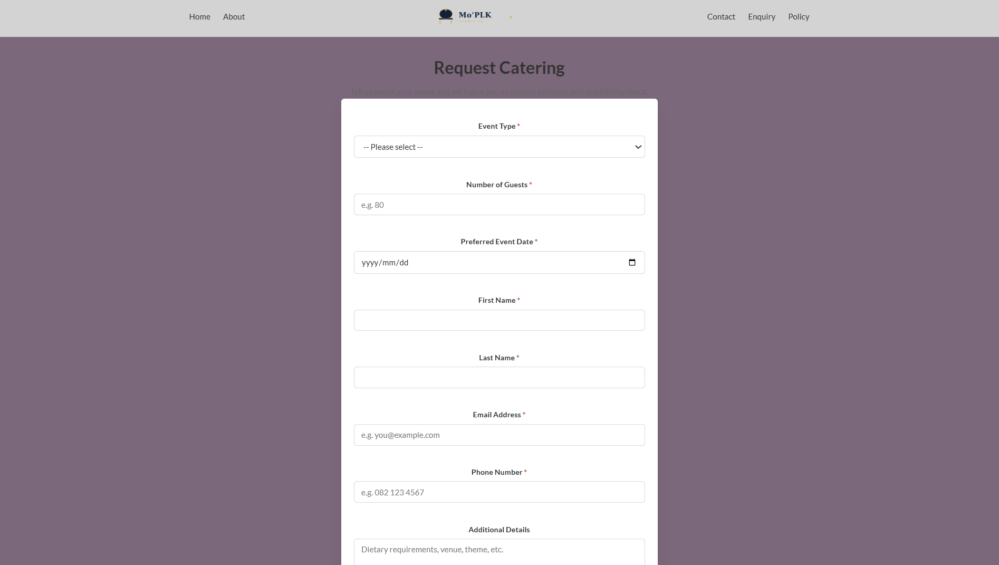
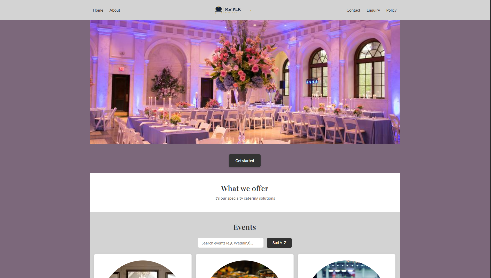
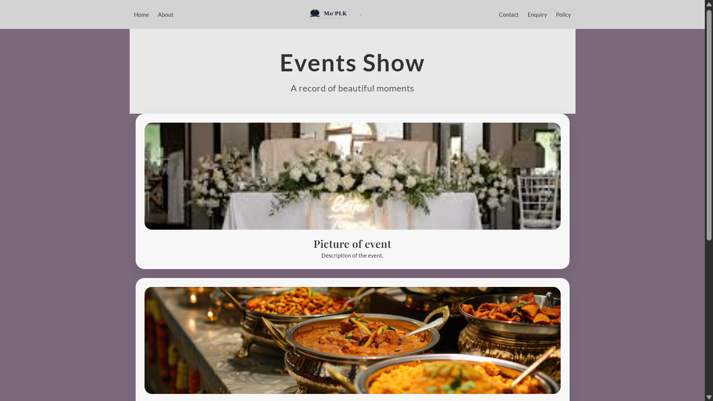

# Mo'PLK Events Co. - Web Development Project

## Student Information
- **Name:** Trevor Kabe
- **Student Number:** ST10503290

---

## Project Overview
Mo'PLK Events Co. started as something I did with friends back in Turfloop, helping neighbours plan their events. This project turns that into a proper website — somewhere people can actually find us, see what we do, look at past events, and request a catering quote without having to phone first. It's a multi-page site covering the home page, an About page, a Contact page, a catering Enquiry page, our Policies, and a gallery of Previous Events.

---

## Website Goals and Objectives
- Make it obvious within a few seconds what Mo'PLK Events Co. actually does.
- Let people request a catering quote and get an instant estimate, instead of waiting on a phone call.
- Keep the navigation simple — nobody should have to dig to find the Contact or Enquiry page.
- Build something I can keep adding to after the module ends, since this is a real business and not just an assignment.

---

## Key Features and Functionality
- Multi-page HTML site with semantic structure throughout.
- Consistent navigation across every page (Home, About, Contact, Enquiry, Policies, Previous Events).
- A catering enquiry form that gives an instant cost estimate and checks date availability.
- A general contact form with AJAX submission (no page reload).
- An interactive map on the Contact page showing where we're based.
- A collapsible accordion on the Policies page, and a lightbox gallery on the Previous Events page.
- Live search and sort on the home page's events grid.
- One shared external stylesheet for the whole site.
- Fully responsive across desktop, tablet, and mobile.

---

## Part 1 - Building the Foundation

Part 1 focuses on building the foundational website structure and content:

- Created the main page (`index.html`) with an overview and navigation.
- Added an About page (`About.html`) describing the organisation.
- Added a Contact page (`contact.html`) for getting in touch.
- Added a Policies page (`policies.html`) for terms and privacy information.
- Added an Events page (`Previousevents.html`) to show past or planned events.
- Included images in the `Images/` folder to support page content.

---

## Part 2 - CSS Styling and Responsive Design

Part 2 focuses on styling the website and making it responsive:

- Created an external stylesheet and linked it to all HTML pages.
- Established base styles: font family, font size, colour scheme, and CSS reset.
- Applied typography styles using `font-family`, `font-size`, `font-weight`, `line-height`, and `letter-spacing`.
- Built layout structure using CSS Flexbox (navigation) and CSS Grid (events section and footer).
- Applied visual styles including `background-color`, `border`, `box-shadow`, and `color`.
- Used pseudo-classes `:hover`, `:focus`, and `:active` on links, buttons, and icons.
- Used CSS variables (`:root`) for consistent colours, fonts, and spacing across the site.
- Implemented responsive design with media queries at two breakpoints:
  - Tablet: `max-width: 900px`
  - Mobile: `max-width: 600px`
- Used relative units (`rem`, `%`, `fr`) throughout for scalable sizing.

---

## Part 3 - Enhancing Functionality and SEO

Part 3 focuses on JavaScript functionality, forms, and search engine optimisation:

- **Stylesheet consolidation:** merged five separate, near-duplicate CSS files (`about.css`, `contact.css`, `policies.css`, `previousevents.css`, `styles.css`) into a single shared `css/styles.css`, properly taking advantage of CSS's cascading nature as required by the Part 2 rubric. Fixed two bugs found in the process: an inconsistent navbar logo size across pages, and a class-name collision where `.event-card` was defined twice with conflicting styles (renamed the Previous Events version to `.past-event-card`).
- **Enquiry form (`enquiry.html`):** new page allowing visitors to request a catering quote. Collects event type, guest count, preferred date, and contact details.
- **Contact form (`contact.html`):** added a required "type of message" field (General Enquiry, Compliment, Complaint, Partnership, Other) as required by the brief. Replaced the original "confidential information" checkbox with an optional newsletter opt-in.
- **HTML5 form validation:** `required`, `type="email"`, `type="tel"` with `pattern`, `minlength`, `min`/`max`, and `type="date"` attributes used across both forms.
- **JavaScript validation (`js/form-validation.js`):** validates all fields on blur and live while typing, with field-specific inline error messages. Submission is blocked until all fields pass.
- **Dynamic response on the enquiry form:** after validation, JavaScript calculates an estimated cost (guests × rate for the selected event type) and checks the requested date against a list of already-booked dates, displaying the result instantly via DOM manipulation — no page reload.
- **AJAX submission on the contact form:** uses the Fetch API to submit form data asynchronously, with a success/error message shown inline.
- **Accordion (interactive element):** the Policies page now uses a collapsible accordion — clicking a heading expands or collapses its content, with the panel height animated via JavaScript and accessible `aria-expanded` attributes.
- **Lightbox gallery (interactive element):** clicking any photo on the Previous Events page opens it full-size in an overlay, closable via the close button, clicking outside the image, or the Escape key.
- **Search and sort (dynamic content):** the Events section on the home page includes a live search box that filters event cards by name as you type, plus a "Sort A–Z" button that reorders the cards alphabetically and can be reset back to the original order.
- **Interactive map:** added a Leaflet map (with free OpenStreetMap tiles, no API key needed) to the Contact page, showing the business location in Polokwane with a marker and popup.
- **SEO - on-page:** descriptive `<title>` and `<meta name="description">` tags added to every page; `<meta name="keywords">` added to every page targeting relevant catering/location terms; all images use descriptive, keyword-relevant `alt` text and were renamed from generic names (e.g. `webpage.jpg`) to descriptive ones (e.g. `team-member-1.jpg`, `wedding-event-catering.jpg`); heading tags (`h1`, `h2`, `h3`) used in a logical structure on every page; internal links connect every page to every other relevant page.
- **SEO - technical:** added `robots.txt` to allow search engine crawling, and `sitemap.xml` listing all pages for search engines.
- **Deployment:** added a root-level redirect `index.html` so the site works correctly when hosted on Netlify or GitHub Pages (the real homepage lives in `html/index.html`).

---

## Sitemap

- `index.html` — Home page
- `About.html` - About the organisation
- `contact.html` - Contact information
- `enquiry.html` - Catering quote request form
- `policies.html` - Policies and terms
- `Previousevents.html` - Past events
- `css/styles.css` - Single external stylesheet (linked to all pages)
- `js/form-validation.js` - Shared form validation and submission logic
- `js/interactive.js` - Accordion, lightbox gallery, and events search/sort logic
- `js/map.js` - Interactive Leaflet map on the Contact page
- `robots.txt` - Search engine crawler instructions
- `sitemap.xml` - List of all pages for search engines
- `index.html` (root) - Redirects to `html/index.html` for hosting compatibility
- `Images/` - Folder containing all site images

---

## Changelog

| Date | Description |
|------|-------------|
| 2026-04-14 | Created README with project overview, goals, features, part details, sitemap, and references |
| 2026-05-25 | Part 2: Created external stylesheet `style.css` and linked it to all HTML pages |
| 2026-05-25 | Part 2: Added base styles — font family, colour scheme, CSS reset on `body` and `*` |
| 2026-05-25 | Part 2: Applied typography styles — `font-family`, `font-size` in `rem`, `line-height`, `letter-spacing` on headings |
| 2026-05-26 | Part 2: Built navigation layout using CSS Flexbox |
| 2026-05-26 | Part 2: Built events grid and footer layout using CSS Grid |
| 2026-05-26 | Part 2: Added visual styles — `background-color`, `border`, `box-shadow` on cards, buttons, and footer |
| 2026-05-26 | Part 2: Added `:hover`, `:focus`, and `:active` pseudo-classes to all interactive elements |
| 2026-05-26 | Part 2: Added CSS variables in `:root` for colours, fonts, spacing, and transitions |
| 2026-05-27 | Part 2: Added responsive media queries for tablet (900px) and mobile (600px) breakpoints |
| 2026-05-28 | Part 2: Replaced all `px` font sizes with relative `rem` units |
| 2026-05-28 | Part 2: Updated README with Part 2 section, changelog entries, and corrected references |
| 2026-06-15 | Part 3 (Part 2 feedback): Consolidated `about.css`, `contact.css`, `policies.css`, `previousevents.css`, and `styles.css` into a single shared `css/styles.css` to properly apply the cascading nature of CSS |
| 2026-06-15 | Part 3 (Part 2 feedback): Fixed inconsistent navbar logo size across pages by introducing a `--nav-logo-width` variable |
| 2026-06-15 | Part 3 (Part 2 feedback): Fixed a class-name collision between the home page's `.event-card` and the Previous Events page's card — renamed the latter to `.past-event-card` |
| 2026-06-15 | Part 3: Created `enquiry.html` with event type, guest count, date, and contact fields |
| 2026-06-15 | Part 3: Added a required "type of message" field to `contact.html`, replacing the confidential-information checkbox with an optional newsletter opt-in |
| 2026-06-15 | Part 3: Created `js/form-validation.js` with field-level validation, inline error messages, and live re-validation on input |
| 2026-06-15 | Part 3: Implemented AJAX submission (Fetch API) on the contact form |
| 2026-06-15 | Part 3: Implemented dynamic cost estimate and date-availability check on the enquiry form using DOM manipulation |
| 2026-06-17 | Part 3: Converted Policies page into an accessible accordion (`aria-expanded`, animated height) |
| 2026-06-17 | Part 3: Added a lightbox gallery to the Previous Events page (click to enlarge, close via button/Escape/click-outside) |
| 2026-06-17 | Part 3: Added live search and "Sort A–Z" functionality to the home page events grid |
| 2026-06-17 | Part 3: Added `<title>` and `<meta name="description">` tags to every page, and descriptive `alt` text to every image, for on-page SEO |
| 2026-06-17 | Part 3: Added `robots.txt` and `sitemap.xml` for technical SEO |
| 2026-06-17 | Part 3: Added a root-level redirect `index.html` so the site resolves correctly when deployed, since the real homepage lives in `html/index.html` |
| 2026-06-17 | Part 3: Deployed the site (see live link in submission) |
| 2026-06-18 | Part 3 (Part 2 feedback): Renamed generic image files (`webpage.jpg`, `Eventpicture.jpg`, etc.) to descriptive, SEO-friendly names (`team-member-1.jpg`, `wedding-event-catering.jpg`, etc.) and updated all references |
| 2026-06-18 | Part 3: Added `<meta name="keywords">` tags to every page |
| 2026-06-18 | Part 3: Added an interactive Leaflet map to the Contact page showing the business location, with a marker and popup (uses free OpenStreetMap tiles, no API key needed) |
| 2026-06-19 | Part 3 (bug fix): `js/Map.js` was saved with a capital "M" while every page links to `../js/map.js` (lowercase) — this works on Windows/Mac but breaks on case-sensitive hosts like GitHub Pages. Renamed the file to lowercase. |
| 2026-06-19 | Part 3 (bug fix): `styles.css` referenced a CSS variable, `--transition-smooth`, that was never defined in `:root` — replaced with the existing `--transition-fast` variable on form input focus states. |
| 2026-06-19 | Part 3 (bug fix): `About.html` team section was accidentally pointing at the responsive-testing screenshots (`phone.png`, `Tablet.jpg`, `Sitemap.png`) used elsewhere in this README, instead of real team photos. Replaced with placeholder filenames (`team-member-1.jpg` through `team-member-4.jpg`) and improved alt text. |
| 2026-06-19 | Part 3 (bug fix): `Previousevents.html` gallery was duplicating the hero image and the Wedding Events card image instead of having its own photos. Pointed it at dedicated placeholder filenames (`previous-event-photo-1.jpg`, `previous-event-photo-2.jpg`). |
| 2026-06-19 | Part 3 (bug fix): Corrected this README, which incorrectly described the Contact page map as a Google Map requiring an API key — the actual implementation uses Leaflet with free OpenStreetMap tiles. |
| 2026-06-19 | Rewrote the Project Overview, Goals, and Key Features sections in my own words |

---

## References

Bunnypants Graphic and Web Design Studio, 2025. *Cost to develop a website in South Africa: the complete guide*. [online] Available at: <https://www.bunnypants.co.za/website-development-cost-complete-guide-2025/> [Accessed 13 April 2026].

Depositphotos, 2026. *Photo picture web icon in flat style — vector*. [electronic print] Available at: <https://depositphotos.com/vector/photo-picture-web-icon-in-flat-style-89250312.html> [Accessed 16 April 2026].

Flux Academy, 2025. *Figma tutorial for beginners (13-min crash course)*. [video online] Available at: <https://www.youtube.com/watch?v=jQ1sfKIl50E> [Accessed 19 April 2026].

Font Awesome, 2024. *Font Awesome free icons*. [online] Available at: <https://fontawesome.com> [Accessed 28 May 2026].

Formspree, 2024. *Formspree: form backend for static sites*. [online] Available at: <https://formspree.io> [Accessed 15 June 2026].

Google Fonts, 2024. *Lato*. [online] Available at: <https://fonts.google.com/specimen/Lato> [Accessed 27 May 2026].

Google Fonts, 2024. *Playfair Display*. [online] Available at: <https://fonts.google.com/specimen/Playfair+Display> [Accessed 28 May 2026].

Google Search Central, 2024. *Build and submit a sitemap*. [online] Available at: <https://developers.google.com/search/docs/crawling-indexing/sitemaps/build-sitemap> [Accessed 17 June 2026].

Google Search Central, 2024. *Introduction to robots.txt*. [online] Available at: <https://developers.google.com/search/docs/crawling-indexing/robots/intro> [Accessed 17 June 2026].

Leaflet, 2024. *Leaflet: an open-source JavaScript library for interactive maps*. [online] Available at: <https://leafletjs.com> [Accessed 18 June 2026].

Lyyti, 2025. *Event marketing KPIs: metrics you need to track*. [online] Available at: <https://www.lyyti.com/en/blog/event-marketing-kpis-metrics-you-need-to-track> [Accessed 13 April 2026].

Mozilla Developer Network, 2024. *CSS grid layout*. [online] Available at: <https://developer.mozilla.org/en-US/docs/Web/CSS/CSS_grid_layout> [Accessed 26 May 2026].

Mozilla Developer Network, 2024. *Flexbox*. [online] Available at: <https://developer.mozilla.org/en-US/docs/Learn_web_development/Core/CSS_layout/Flexbox> [Accessed 26 May 2026].

Mozilla Developer Network, 2024. *Responsive design*. [online] Available at: <https://developer.mozilla.org/en-US/docs/Learn_web_development/Core/CSS_layout/Responsive_Design> [Accessed 27 May 2026].

Mozilla Developer Network, 2024. *Using CSS custom properties (variables)*. [online] Available at: <https://developer.mozilla.org/en-US/docs/Web/CSS/Using_CSS_custom_properties> [Accessed 27 May 2026].

Mozilla Developer Network, 2024. *Using the Fetch API*. [online] Available at: <https://developer.mozilla.org/en-US/docs/Web/API/Fetch_API/Using_Fetch> [Accessed 15 June 2026].

Mozilla Developer Network, 2024. *Client-side form validation*. [online] Available at: <https://developer.mozilla.org/en-US/docs/Learn_web_development/Extensions/Forms/Form_validation> [Accessed 15 June 2026].

Slickplan, 2023. *What is a sitemap? let's break it down simply*. [video online] Available at: <https://www.youtube.com/watch?v=GjEIuy9s4is> [Accessed 16 April 2026].